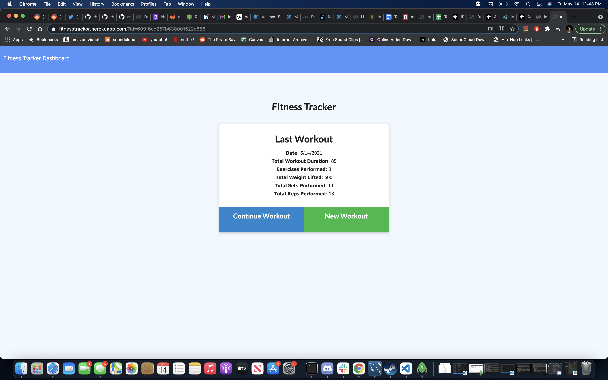

# Workout Tracker

## Site Image


## Summary
This application was designed to track your workouts by what you did, how much you did, and how long you went for.  It uses express for the routing between different pages and functions of the app and mongoDB/mongoose for the models and the database to store all the workouts you've done.  Chart.js is also implemented to give a visual representation of the work you've done through the course of the week.

## Code Snippet
The aggregate function used to get the total duration based on the existing durations of the workouts added
```
router.get('/api/workouts', (req,res) => {
    Workout.aggregate([
        {
            $addFields:{
                totalDuration: {$sum:'$exercises.duration'}
            },
        },
    ])
```
## Technology Used
- mongoDb - NoSQL Database used for data storage on this application
- mongoose - ODM used for creating the models and relationships to be applied in the mongo database
- JavaScript - Language used to write all the working cod efor the application
- Chart.js - Used to show the data in a visual representation
- Express - Used for the routing necessary to make the app function
- Heroku - Used to deploy the app onto a live server

## Author Links
- [LinkedIn] (https://www.linkedin.com/in/marko-sanchez-800)
- [GitHub] (https://github.com/markosanchez800)
